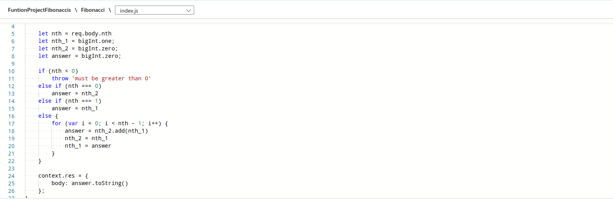
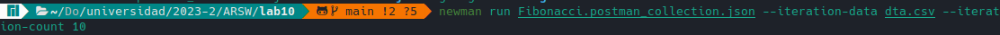
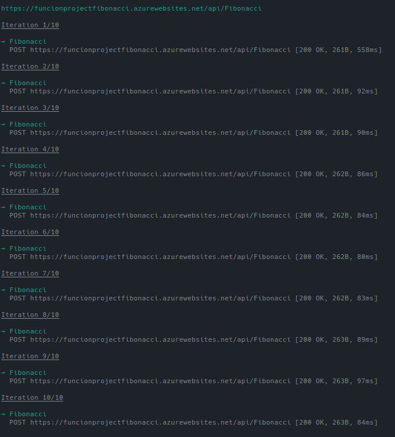
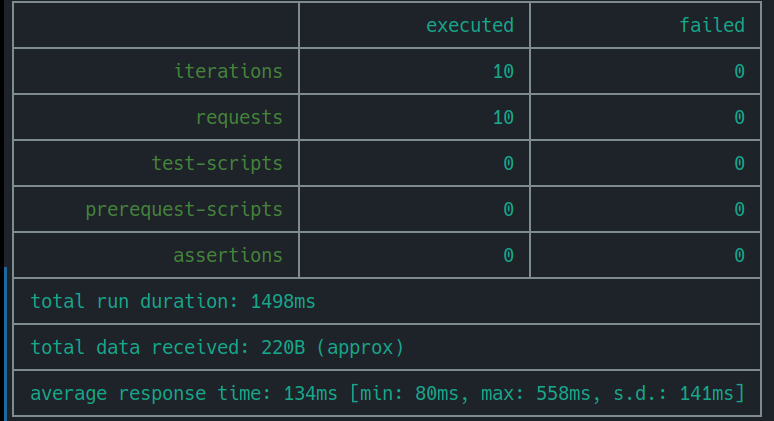
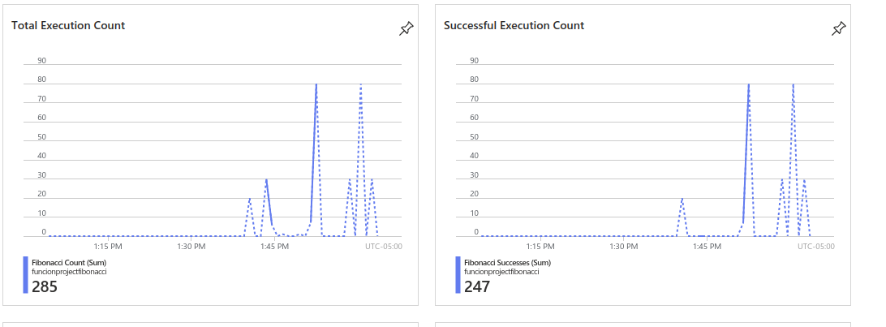

### Escuela Colombiana de Ingeniería
### Arquitecturas de Software - ARSW

## Escalamiento en Azure con Maquinas Virtuales, Sacale Sets y Service Plans

### Dependencias
* Cree una cuenta gratuita dentro de Azure. Para hacerlo puede guiarse de esta [documentación](https://azure.microsoft.com/es-es/free/students/). Al hacerlo usted contará con $100 USD para gastar durante 12 meses.
Antes de iniciar con el laboratorio, revise la siguiente documentación sobre las [Azure Functions](https://www.c-sharpcorner.com/article/an-overview-of-azure-functions/)

### Parte 0 - Entendiendo el escenario de calidad

Adjunto a este laboratorio usted podrá encontrar una aplicación totalmente desarrollada que tiene como objetivo calcular el enésimo valor de la secuencia de Fibonnaci.

**Escalabilidad**
Cuando un conjunto de usuarios consulta un enésimo número (superior a 1000000) de la secuencia de Fibonacci de forma concurrente y el sistema se encuentra bajo condiciones normales de operación, todas las peticiones deben ser respondidas y el consumo de CPU del sistema no puede superar el 70%.

### Escalabilidad Serverless (Functions)

1. Cree una Function App tal cual como se muestra en las  imagenes.

2. Instale la extensión de **Azure Functions** para Visual Studio Code.

3. Despliegue la Function de Fibonacci a Azure usando Visual Studio Code. La primera vez que lo haga se le va a pedir autenticarse, siga las instrucciones.

4. Dirijase al portal de Azure y pruebe la function.

Se realiza la Conexión entre azure y VS code.

5. Modifique la coleción de POSTMAN con NEWMAN de tal forma que pueda enviar 10 peticiones concurrentes. Verifique los resultados y presente un informe.

    Se crea un archivo .csv (dta.csv) donde se almacena una lista de valores para ejecutar, se descarga una coleccion usando POSTMAN (Fibonacci.postman_collection.json)

    Se ejecuta el siguen comando que utiliza los valores de dta.csv para mandarlos al programa.

6. Cree una nueva Function que resuleva el problema de Fibonacci pero esta vez utilice un enfoque recursivo con memoization. Pruebe la función varias veces, después no haga nada por al menos 5 minutos. Pruebe la función de nuevo con los valores anteriores. ¿Cuál es el comportamiento?.

**Preguntas**

* ¿Qué es un Azure Function?

    Azure Functions es un servicio de computación sin servidor (serverless) proporcionado por Microsoft Azure. Permite ejecutar código en respuesta a eventos sin la necesidad de gestionar directamente la infraestructura subyacente. En lugar de preocuparse por la administración de servidores, escalabilidad y mantenimiento, puedes centrarte en escribir el código de la función y dejar que Azure se encargue de la implementación y ejecución.

* ¿Qué es serverless?

    Es un paradigma de computación en la nube que permite ejecutar aplicaciones y servicios sin la necesidad de gestionar directamente los servidores subyacentes (computación sin servidor).

* ¿Qué es el runtime y que implica seleccionarlo al momento de crear el Function App?

    Carga y ejecuta todas las aplicaciones de un programa en una plataforma específica. Este entorno de ejecución permite la ejecución de funciones de manera independiente del sistema operativo subyacente
    Al momento de crear el Function App ejecuta la aplicacion independientemente del sistema operativo.

* ¿Por qué es necesario crear un Storage Account de la mano de un Function App?

    Porque las Function Apps en Azure a menudo necesitan un almacenamiento persistente para diversos propósitos y un Storage Account proporciona un medio de almacenamiento duradero para estas necesidades

* ¿Cuáles son los tipos de planes para un Function App?, ¿En qué se diferencias?, mencione ventajas y desventajas de cada uno de ellos.

    Consumo:
        Ventajas:
            Escala automáticamente según la demanda de la aplicación.
            Pago basado en el consumo real de recursos y tiempo de ejecución.
            Ideal para cargas de trabajo esporádicas o de baja a moderada utilización.
        Desventajas:
            Tiempos de inicio pueden ser más lentos debido a la inactividad.
            Limitaciones en términos de recursos (CPU, memoria) en comparación con planes más grandes.

    Premium Plan:
        Ventajas:
            Escalado automático y mayor capacidad en comparación con el plan de consumo.
            Mejor rendimiento con instancias precalentadas para reducir los tiempos de inicio.
            Conexión virtual a redes virtuales (VNET Integration).
        Desventajas:
            Mayor costo en comparación con el plan de consumo.
            Aún tiene límites en recursos, pero mayores que el plan de consumo.

    App Service Plan:
        Ventajas:
            Control más granular sobre el entorno y recursos subyacentes.
            Escalabilidad vertical y horizontal personalizada.
            Sin tiempo de espera de inicio debido a la configuración de instancias dedicadas.
        Desventajas:
            Más costoso en comparación con los planes de consumo o premium.
            La escala automática debe configurarse manualmente.

* ¿Por qué la memoization falla o no funciona de forma correcta?

    La falla se debe a que los números involucrados en los cálculos son demasiado grandes, agotando rápidamente la memoria con cada llamada. La magnitud de estos números puede superar las capacidades de manejo de memoria eficiente, llevando a problemas de rendimiento y posiblemente a fallas en la ejecución del programa.

* ¿Cómo funciona el sistema de facturación de las Function App?

    El sistema de facturación de las Azure Function Apps se basa en el consumo de recursos y el tiempo de ejecución real de tus funciones.

    Modelo de Pago por Consumo:

        Las Azure Function Apps siguen un modelo de pago por consumo. Esto significa que solo pagas por los recursos que realmente utilizas durante la ejecución de tus funciones.

    Recursos Medidos:

        Los recursos medidos incluyen tiempo de CPU, memoria utilizada y almacenamiento. Estos recursos se miden en función de las necesidades de tu función durante la ejecución.

    Tiempo de Ejecución Real:

        Solo se factura el tiempo real de ejecución de tus funciones. Esto significa que el tiempo que tus funciones pasan inactivas no se contabiliza en la factura.

    Escalabilidad Automática:

        Si estás utilizando un plan de consumo, tus funciones se escalan automáticamente según la carga de trabajo. Pagas por la cantidad de recursos consumidos durante cada escalado.

    Facturación por Períodos de 100 ms:

        El tiempo de ejecución se mide en intervalos de 100 milisegundos. Si una función se ejecuta durante 250 ms, se facturará por 300 ms (tres intervalos de 100 ms).

    Costos Adicionales para Recursos Asociados:

        Además del tiempo de ejecución, es posible que haya costos adicionales asociados con el uso de recursos adicionales, como almacenamiento, transferencia de datos y llamadas a servicios externos.

    Almacenamiento de Resultados y Logs:

        El almacenamiento de resultados, logs y otros datos generados por tus funciones también puede contribuir a los costos, especialmente si se utiliza almacenamiento persistente como Azure Blob Storage.

* Informe

    El informe se encuentra en el desarrollo del README.
